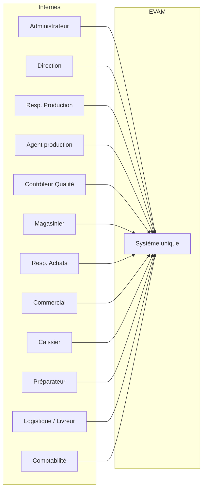
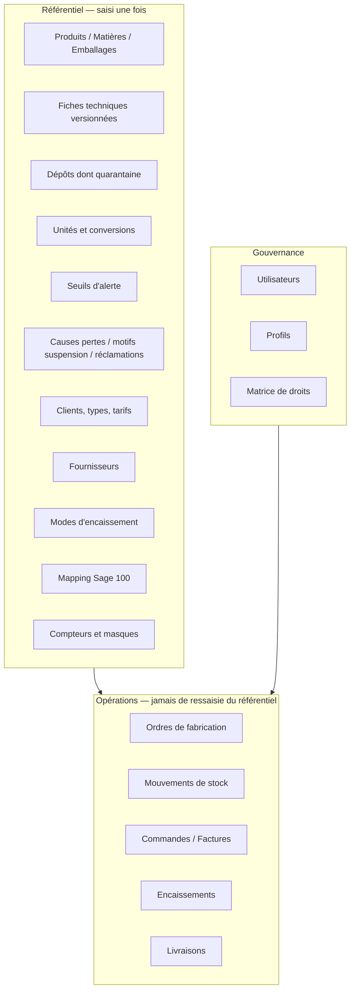
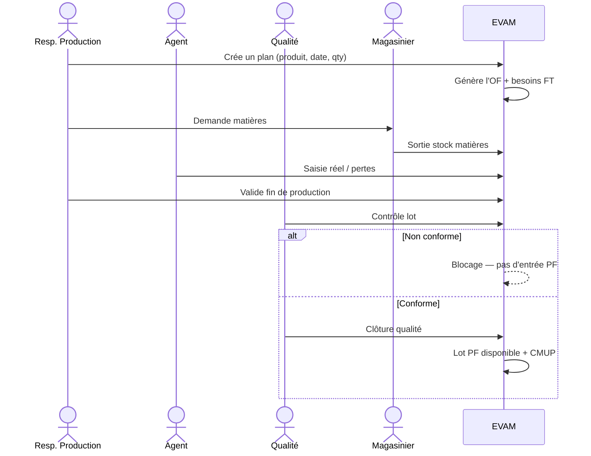
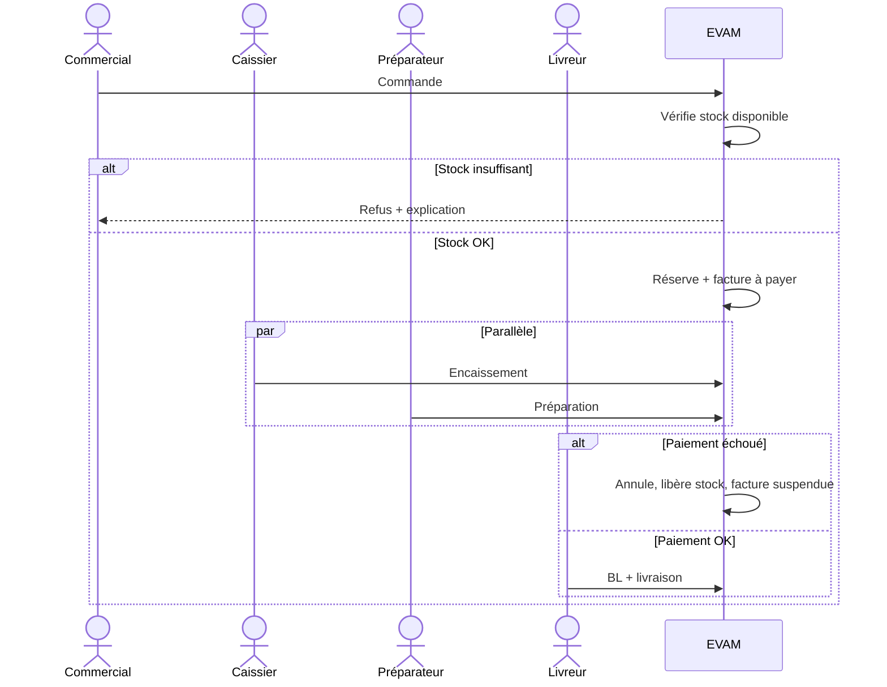

# EVAM — Logiciel de gestion intégré

**Unité de production** · Eau · Jus / boissons · Yaourts  
**Stack** · Django REST Framework · PostgreSQL · Next.js  
**Horizon** · Développement 1er septembre → 21 décembre 2026 · Go-live 1er janvier 2027  
**Document** · Direction produit, architecture d’interfaces et roadmap maquette UI/UX

---

## Maquette UI (exécutable)

Prototype Next.js navigable, données mockées, **sans backend**. La logique métier P1 y est jouable (garde stock, double clôture OF, paiement avant livraison, facture suspendue exclue de Sage).

```bash
npm install
npm run dev
```

Ouvrir [http://localhost:3000](http://localhost:3000). Mot de passe unique : `evam`.  
Choisir un compte sur l’écran de connexion, ou changer de profil en haut à droite une fois connecté.

Parcours à tester en premier :

1. **Resp. Production** → Planning → générer un OF → **Qualité** clôture le lot yaourt en attente → le stock PF augmente.
2. **Commercial** → Nouvelle commande avec une quantité supérieure au disponible → **blocage**. Puis quantité réaliste → facture à payer.
3. **Caissier** → encaisser (succès) puis **Logistique** → BL déverrouillé. Rejouer un échec CB → facture suspendue, Sage l’exclut.

---

## 1. La vraie idée du projet

EVAM n’est pas un assemblage de modules (production, stock, vente, caisse). C’est **un système unique de vérité opérationnelle** pour une usine agroalimentaire.

Aujourd’hui, une usine de ce type vit dans la ressaisie : le plan de production est dans un fichier, le stock dans un autre, la commande dans un troisième, la caisse ailleurs, et Sage 100 à la fin. Chaque rupture d’information crée un écart : stock virtuel, livraison d’une facture impayée, lot non contrôlé déjà vendu, coût de revient approximatif.

**EVAM casse ce modèle.** Une information saisie une seule fois alimente automatiquement tous les modules concernés. Le logiciel ne « gère » pas des écrans : il **orchestre un flux physique réel** :

```
Planifier → Fabriquer → Contrôler → Stocker → Vendre → Encaisser → Livrer → Coûter → Comptabiliser
```

La production n’est **pas déclenchée par la commande client**. EVAM est un ERP **make-to-stock** : on planifie un produit, une date, une quantité ; le système génère l’Ordre de Fabrication ; le lot n’entre en stock vendable qu’après **double validation** (fin de production + clôture qualité). Ensuite seulement le commercial peut vendre — et uniquement si le stock disponible le permet. Le paiement et la préparation partent en parallèle, mais **aucune livraison n’existe tant que la facture n’est pas payée**.

C’est cette chaîne, et uniquement cette chaîne, qui justifie le projet. Si un écran n’alimente pas ce flux, il n’a pas sa place en V1.

### Ce que le produit doit faire ressentir

| Promesse métier | Traduction UI |
| --- | --- |
| Une saisie, partout | Jamais de double formulaire. Les écrans aval ne font que **consommer** l’amont. |
| Rien ne se vend sans stock | Le commercial ne peut pas « forcer ». Le blocage est visible, explicable, actionnable. |
| Rien ne se livre sans paiement | La préparation peut avancer. Le BL reste **verrouillé**. |
| Rien n’entre en stock sans qualité | Un OF « terminé » n’est pas un OF « vendable ». Deux états, deux rôles, deux écrans. |
| Le coût n’est pas un export Excel | Le CMUP et le coût d’OF se **lisent** dans le flux, pas dans un rapport isolé. |

---

## 2. Principes de conception UI/UX

Ces principes dirigent **toutes** les maquettes Next.js. Ils ne sont pas décoratifs.

1. **Flux avant formulaire.** Chaque écran s’inscrit dans un cycle de vie (OF, Commande/Facture). L’utilisateur doit toujours savoir *où il est* dans le statut, *ce qui bloque*, *quelle action suivante*.
2. **Rôle = interface, pas juste un menu grisé.** Un agent de production ne voit pas la même densité, ni les mêmes actions, qu’un directeur ou un caissier. Le masquage est structurel (layout, navigation, actions primaires).
3. **Densité industrielle, calme visuel.** Logiciel d’usine, pas dashboard startup. Tableaux denses, filtres persistants, actions contextuelles, peu d’animation, zéro décor superflu.
4. **L’état métier est le hero.** Brouillon, réservé, payé, suspendu, en quarantaine, clôturé qualité : les statuts sont des objets visuels de premier plan, pas des badges secondaires.
5. **Le blocage explique.** Un refus (stock insuffisant, facture impayée, lot non conforme) affiche **pourquoi**, **quoi faire**, et **vers quel écran aller**.
6. **Paramétrage en amont, opérationnel en aval.** On ne mélange jamais un CRUD de référentiel avec une saisie de production. Deux familles d’écrans, deux langages visuels.

---

## 3. Direction visuelle — design system EVAM

Identité d’une unité industrielle de l’eau et des produits laitiers : **précision, traçabilité, confiance**. Pas de gradient, pas d’illustration ludique, pas de palette arc-en-ciel.

### 3.1 Langage visuel

| Token | Direction | Usage |
| --- | --- | --- |
| **Fond** | Gris froid très clair `#F4F6F8` + surfaces blanches | Atelier, lisibilité 8h/jour |
| **Texte** | Encre `#0F172A` / secondaire `#475569` | Hiérarchie stricte |
| **Accent primaire** | Bleu industriel `#0E4D6C` (eau + sérieux) | Navigation, actions primaires, focus |
| **Accent métier** | Teal `#0F766E` | Production, lots, traçabilité |
| **Succès** | Vert contrôlé `#15803D` | Payé, conforme, clôturé, livré |
| **Attention** | Ambre `#B45309` | Seuil stock, OF en cours, préparation partielle |
| **Blocage** | Rouge `#B91C1C` | Non conforme, suspendu, livraison interdite |
| **Typo UI** | `IBM Plex Sans` ou `Source Sans 3` | Dense, neutre, lisible en tableau |
| **Typo chiffres** | `IBM Plex Mono` / `tabular-nums` | Stocks, CMUP, montants, lots |
| **Grille** | 8 px · sidebar 264 px · content max fluide | ERP, pas site vitrine |
| **Rayon** | 6 px max | Technique, pas « card SaaS » |
| **Icônes** | Lucide, trait 1.5, jamais emoji | Un seul set |

### 3.2 Composants du design system (à figer dès Sprint 1)

Ces composants sont le contrat maquette → Next.js. On ne dessine pas 80 écrans différents : on compose.

- **AppShell** — sidebar par rôle, topbar (entité active, dépôt, utilisateur, notifications métier)
- **PageHeader** — titre + fil d’Ariane + statut d’objet + actions primaires/secondaires
- **StatusStepper** — cycle de vie OF ou Commande/Facture
- **DataTable** — tri, filtres persistants, densité compacte, actions ligne, export
- **FilterBar** — période, dépôt, produit, statut, responsable
- **FormSection** — blocs métier, pas un long formulaire unique
- **TabbedRecord** — fiche technique, OF, commande (onglets métier)
- **StockGuard** — bandeau de vérification stock (ok / insuffisant / réservé)
- **PaymentGuard** — verrou livraison si facture non payée
- **QualityBanner** — lot conforme / bloqué / en attente contrôle
- **ConfirmDialog** — actions irréversibles (clôture OF, clôture caisse, export Sage)
- **Empty / Error / Blocked states** — toujours un CTA métier, jamais une page morte
- **PrintView** — OF, BL, facture, inventaire (A4, sobre)

### 3.3 Architecture front Next.js (maquette et socle)

```
app/
  (auth)/login
  (app)/
    layout.tsx                 # AppShell + garde rôle
    dashboard/                 # Direction — indicateurs vitaux
    parametrage/               # Référentiels (admin / responsables)
    production/
    stocks/
    approvisionnement/
    commercial/
    caisse/
    distribution/
    reclamations/
    couts/
    comptabilite/              # Brouillards + export Sage 100
    admin/
components/
  ui/                          # primitives design system
  domain/                      # StatusStepper, StockGuard, PaymentGuard…
lib/
  api/                         # clients DRF, types alignés UML
  auth/                        # JWT, profils, masquage UI
  format/                      # CMUP, lots, dates, montants
```

**Règle front :** l’API d’un module est gelée à J+3 du sprint. Les maquettes du module sont validées **avant** ce gel. Pas de maquette pendant que le modèle Django bouge encore.

---

## 4. Cartographie des acteurs et de leurs interfaces

Chaque acteur a une **entrée unique** (home de rôle) et un **périmètre d’écrans**. L’administrateur voit tout ; personne d’autre ne navigue comme un admin.



| Acteur | Home de rôle | Écrans qu’il *possède* | Ce qu’il ne doit jamais voir en V1 |
| --- | --- | --- | --- |
| **Administrateur** | Pilotage système | Utilisateurs, profils, droits, paramètres généraux, journaux | Saisie opérationnelle au quotidien |
| **Direction** | Tableau de bord | Indicateurs vitaux, drill-down lecture | Formulaires de saisie |
| **Resp. Production** | Planning & OF | Plan, génération OF, besoins, validation fin de production, synthèse clôture | Caisse, Sage |
| **Agent de production** | Suivi atelier | Saisie réel, consommations, incidents, pertes | Paramétrage fiches, commandes clients |
| **Contrôleur Qualité** | File des lots | Contrôle, blocage, clôture qualité | Modification du plan |
| **Magasinier** | Mouvements | Demandes matières, E/S/retours/transferts, inventaires, alertes | Prix de vente, caisse |
| **Resp. Achats** | Approvisionnement | Alertes, besoins, DA, commandes fournisseurs, réceptions | OF atelier |
| **Commercial** | Commandes | Création commande + garde stock, suivi statut | Forcer un stock, encaisser (sauf profil mixte) |
| **Caissier** | Caisse du jour | Encaissements, factures à payer / suspendues, clôture caisse | Modifier une commande livrée |
| **Préparateur** | File préparation | Commandes à préparer, préparation complète/partielle | Encaissement |
| **Logistique** | Tournées | BL, chargement, preuve, signature — **verrou paiement** | Débloquer une facture |
| **Comptabilité** | Brouillards | Validation écritures, export Sage 100, exclusion des suspendues | Saisie stock |

---

## 5. Inventaire exhaustif des interfaces (maquettes à produire)

Les écrans ci-dessous constituent le **catalogue UI V1**. Chaque ligne = une maquette (desktop ; mobile uniquement pour Livreur et, en lecture, Direction).

### 5.1 Socle — Authentification & shell

| ID | Écran | Objectif | Composants clés |
| --- | --- | --- | --- |
| AUTH-01 | Connexion | JWT, message d’erreur métier, session | Formulaire sobre, logo EVAM, pas de marketing |
| AUTH-02 | Mot de passe / session expirée | Reprise sans perdre le contexte | Redirect profond |
| SHELL-01 | AppShell | Navigation par rôle, dépôt actif, notifications | Sidebar + topbar |
| SHELL-02 | 403 / 404 métier | Accès refusé vs ressource absente | Explication + retour home de rôle |
| DASH-01 | Dashboard Direction | Stock global, CA jour/période, OF en cours, factures suspendues, alertes seuils | 5 indicateurs vitaux, pas 20 widgets |

### 5.2 Paramétrage (référentiel) — le cœur invisible

Sans ce socle, aucun module ne tient. C’est le **premier livrable UI** (Sprint 1), et le plus sous-estimé.

| ID | Écran | Contenu | Notes UX |
| --- | --- | --- | --- |
| PAR-01 | Liste Produits finis | Code, libellé, famille (eau / jus / yaourt), unité, statut actif | Famille = filtre structurant |
| PAR-02 | Fiche Produit fini | Identité, unités, conditionnement de vente, seuils stock PF, lien fiche technique | Une fiche = un produit planifiable |
| PAR-03 | Liste Matières | Code, type (ingrédient / additif / autre), unité, seuil min | |
| PAR-04 | Fiche Matière | Identité, unité, CMUP courant (lecture), seuil, fournisseurs habituels | CMUP jamais saisi à la main |
| PAR-05 | Liste Conditionnements / emballages | Bouteilles, pots, bouchons, étiquettes, pack | Traités comme des matières spécifiques |
| PAR-06 | Fiche Conditionnement | Unité, lien produits, seuil | |
| PAR-07 | Liste Fiches techniques | Produit, version, statut (brouillon / active / archivée) | **Une seule FT active par produit** |
| PAR-08 | FT — Onglet Composition | Matières, quantités, pertes process prévues | Calcul besoins OF |
| PAR-09 | FT — Onglet Emballages | Nomenclature packing | |
| PAR-10 | FT — Onglet Process | Étapes, durées, consignes atelier | Lecture agent de production |
| PAR-11 | FT — Onglet Rendement | Rendement attendu, tolérances | Écarts à la clôture OF |
| PAR-12 | FT — Onglet Contrôles qualité | Critères, seuils, obligatoire / informatif | Alimente l’écran qualité |
| PAR-13 | Dépôts / emplacements | PF, matières, quarantaine, retours | Obligatoire pour mouvements |
| PAR-14 | Unités & conversions | L, kg, colis, palette | Erreur de conversion = stock faux |
| PAR-15 | Causes de pertes / rebuts | Liste paramétrable | Sprint 3 |
| PAR-16 | Seuils d’alerte stock | Min / critique par article × dépôt | Déclenche besoin d’achat |
| PAR-17 | Clients | Type (comptant / à terme), conditions de paiement, tarifs | Type client → moyens d’encaissement |
| PAR-18 | Tarifs / grilles | Produit × client / famille | Lecture commercial |
| PAR-19 | Fournisseurs | Identité, articles liés, délais | |
| PAR-20 | Modes d’encaissement | Espèces, CB, virement — selon type client | |
| PAR-21 | Mapping comptable Sage | Journaux, comptes, codes export | Issue du spike Sprint 1 |
| PAR-22 | Paramètres généraux | Société, exercice, formats lot, numérotation (OF, commande, facture, BL) | Compteurs non réutilisables |
| PAR-23 | Numérotation & préfixes | Masques `OF-2026-00041`, `FA-…`, `BL-…` | Traçabilité |
| PAR-24 | Motifs de suspension facture | Liste fermée + « autre » commenté | Jamais libre sans trace |
| PAR-25 | Motifs de réclamation | Qualité, casse, écart qty, délai | V1.1 possible mais prévoir le référentiel |

### 5.3 Administration

| ID | Écran | Contenu |
| --- | --- | --- |
| ADM-01 | Utilisateurs | CRUD, activation, rattachement profil |
| ADM-02 | Profils / rôles | 12 profils métier du dossier UML |
| ADM-03 | Matrice des droits | Objet × action (voir / créer / valider / clôturer / exporter) |
| ADM-04 | Journal d’audit (lecture) | Qui a clôturé, qui a suspendu, qui a exporté Sage |

### 5.4 Production

| ID | Écran | Règle visible à l’écran |
| --- | --- | --- |
| PRD-01 | Planning de production | 1 plan = 1 produit + date + quantité → **génère l’OF**, jamais l’inverse |
| PRD-02 | Détail Plan / OF créé | Besoins matières calculés depuis la FT |
| PRD-03 | Besoins matières | Écart besoin vs stock disponible |
| PRD-04 | Demande de matières au magasin | Workflow : demandée → validée magasin → sortie stock |
| PRD-05 | Validation magasin (côté stocks) | Même objet, autre rôle |
| PRD-06 | Suivi de production | Saisie du réel, consommations, incidents |
| PRD-07 | Suivi spécifique **eau** | Compteurs / volumes — écran dédié, pas un champ caché |
| PRD-08 | Pertes et rebuts | Cause paramétrable, quantité, lot |
| PRD-09 | File contrôle qualité | Lots en attente, urgents, bloqués |
| PRD-10 | Contrôle qualité d’un lot | Critères FT, conforme / non conforme, blocage |
| PRD-11 | Fin de production (Resp. Prod.) | Première validation — **n’entre pas le stock PF** |
| PRD-12 | Clôture OF (synthèse) | Écarts, rendement, coût, génération lot — **seule la clôture qualité libère le stock PF** |
| PRD-13 | Historique OF | Lecture, filtres, impression |

**Stepper OF (obligatoire en tête de fiche) :**  
`Créé → Planifié → En production → Fin production → Contrôle qualité → Clôturé`  
Branche : `Non conforme / Bloqué`.

### 5.5 Stocks

| ID | Écran | Règle visible à l’écran |
| --- | --- | --- |
| STK-01 | Situation de stock | Article × dépôt × lot, disponible vs réservé |
| STK-02 | Fiche article stock | Mouvements, CMUP, seuils |
| STK-03 | Entrée | Origine **uniquement** : clôture OF (PF) ou réception fournisseur (matières) |
| STK-04 | Sortie | Consommation OF, vente (via préparation), ajustement contrôlé |
| STK-05 | Retour | Client ou interne, dépôt quarantaine si besoin |
| STK-06 | Transfert | Dépôt A → B, traçabilité lot |
| STK-07 | Inventaire — session | Théorique vs physique |
| STK-08 | Inventaire — comptage | Saisie magasinier |
| STK-09 | Inventaire — écarts & validation | Écriture d’ajustement après validation |
| STK-10 | Alertes seuils | Liste actionnable → besoin d’achat |

Valorisation **CMUP** : affichée en lecture sur chaque mouvement et chaque fiche. Jamais un champ éditable.

### 5.6 Approvisionnement

| ID | Écran | Règle visible à l’écran |
| --- | --- | --- |
| APP-01 | Besoins d’approvisionnement | Calcul auto depuis seuils + besoins OF |
| APP-02 | Demandes d’achat | Workflow de validation |
| APP-03 | Commande fournisseur | Depuis DA validée |
| APP-04 | Réception | Écarts commandé / reçu → **entrée stock matières** |
| APP-05 | Facture d’achat (vue) | Génère brouillard comptable |

### 5.7 Commercial

| ID | Écran | Règle visible à l’écran |
| --- | --- | --- |
| COM-01 | Liste commandes | Statuts alignés cycle Facture |
| COM-02 | Nouvelle commande | **StockGuard obligatoire** avant validation : disponible − déjà réservé |
| COM-03 | Commande refusée stock | Motif clair + lien stock / planning |
| COM-04 | Fiche commande | Lignes, réservation, facture liée, préparation, paiement |
| COM-05 | Clients (opérationnel) | Accès lecture/création selon droits — le référentiel profond reste au paramétrage |

**Stepper Commande / Facture :**  
`Créée → Stock vérifié → Facture à payer → (Payée \| Suspendue) → Préparée → Livrée → Exportée compta`  
Règle : **Suspendue = jamais exportable**.

### 5.8 Caisse

| ID | Écran | Règle visible à l’écran |
| --- | --- | --- |
| CAI-01 | Caisse du jour | File des factures à encaisser |
| CAI-02 | Encaissement | Espèces / CB / virement **selon type client** |
| CAI-03 | Paiement réussi | Libère la livraison (ne crée pas la livraison) |
| CAI-04 | Échec de paiement | Commande annulée, stock réservé **libéré**, facture **suspendue + motif** |
| CAI-05 | Factures suspendues | Liste, motif, interdiction transfert compta |
| CAI-06 | Clôture de caisse | Théorique vs réel, écarts, validation |

### 5.9 Distribution

| ID | Écran | Règle visible à l’écran |
| --- | --- | --- |
| DIS-01 | File à préparer | Uniquement commandes validées |
| DIS-02 | Préparation | Complète ou partielle |
| DIS-03 | Bon de livraison | Édition / impression |
| DIS-04 | Validation BL | **PaymentGuard** : si non payée → action primaire désactivée + explication |
| DIS-05 | Tournée / suivi livraison | Statuts, signature, preuve (upload) |
| DIS-06 | Preuve de livraison | Photo / signature — statut Livrée |

### 5.10 Réclamations (P2 — maquette prévue, build différable)

| ID | Écran | Règle |
| --- | --- | --- |
| REC-01 | Liste réclamations | Lien commande / lot / BL |
| REC-02 | Fiche réclamation | Motif, quarantaine, décision, retour stock |

### 5.11 Coûts, comptabilité, reporting

| ID | Écran | Règle |
| --- | --- | --- |
| CST-01 | Coût matières / OF | CMUP × conso réelle |
| CST-02 | Marges (P2) | Prix vs coût de revient |
| CPT-01 | Brouillards vente & achat | Générés auto, jamais saisis à la main |
| CPT-02 | Validation comptable | Seule la Comptabilité valide |
| CPT-03 | Export Sage 100 | Exclut **systématiquement** les factures suspendues |
| RPT-01 | Dashboard Direction | P1 — indicateurs vitaux |
| RPT-02 | Dashboards modules (P2) | Production / Stock / Commercial / Distribution |

---

## 6. Paramétrage possible — carte de vérité

Tout ce qui est **paramétrable** doit l’être dans `/parametrage` ou `/admin`, jamais dans un écran de saisie atelier. Sinon on casse l’audit et le CMUP.



### Matrice « qui paramètre quoi »

| Objet paramétrable | Admin | Resp. Prod. | Qualité | Achats | Commercial | Comptabilité |
| --- | --- | --- | --- | --- | --- | --- |
| Produits / FT | Valide | Crée / versionne | Critères CQ | — | Lecture | — |
| Matières / emballages | Valide | Propose | — | Crée | — | — |
| Dépôts | Maître | Lecture | Quarantaine | Lecture | — | — |
| Seuils stock | — | PF | — | Matières | — | — |
| Causes pertes | — | Propose | Valide | — | — | — |
| Clients / tarifs | Valide | — | — | — | Crée | Lecture |
| Fournisseurs | Valide | — | — | Maître | — | Lecture |
| Mapping Sage / journaux | — | — | — | — | — | Maître |
| Motifs suspension | Valide | — | — | — | — | Contrôle |
| Utilisateurs / droits | Maître | — | — | — | — | — |

---

## 7. Parcours critiques à prototyper en premier

Trois parcours valident le produit. Toutes les autres maquettes s’alignent dessus.

### 7.1 Circuit usine — du plan au stock vendable



**Maquette prioritaire :** PRD-01 → PRD-04 → PRD-06 → PRD-10 → PRD-12 → STK-01.

### 7.2 Circuit commercial — commande, caisse, livraison



**Maquette prioritaire :** COM-02 (StockGuard) → CAI-02 → CAI-04 → DIS-02 → DIS-04 (PaymentGuard).

### 7.3 Circuit achat — du seuil à l’entrée matières

Alertes / besoins → DA → commande fournisseur → réception (écarts) → stock matières → CMUP.

---

## 8. Roadmap directionnelle des maquettes Next.js

Alignée sur les 8 sprints Scrum du dossier de conception. **La maquette précède le code front** : validation client au Sprint Planning, pas à la Review.

Objectif : un **prototype Next.js navigable** (App Router, design system, données mockées puis API réelle), pas un fichier Figma orphelin. Figma (ou équivalent) sert à figer les 3 parcours critiques ; Next.js est la source de vérité des écrans.

| Phase | Quand | Livrable UI | Critère de done maquette |
| --- | --- | --- | --- |
| **M0 — Fondation** | Avant / J1–J3 Sprint 1 | Design tokens, AppShell, DataTable, FormSection, StatusStepper, Login | Un écran « Produit » et un écran « Login » suffisent à juger le langage |
| **M1 — Paramétrage & Admin** | Sprint 1 | PAR-01→12, PAR-13/14/22/23, ADM-01→03 | Le client crée un produit **avec FT complète multi-onglets** |
| **M2 — Production amont** | Sprint 2 | PRD-01→07, STK demande matières | Un plan génère visuellement un OF et des besoins |
| **M3 — Qualité & stock vivant** | Sprint 3 | PRD-08→13, STK-01→06, CMUP en lecture | Double validation OF visible ; lot PF n’apparaît qu’après qualité |
| **M4 — Stock fin + Appro** | Sprint 4 | STK-07→10, APP-01→05, PAR-16/19 | Inventaire et réception sont des **sessions**, pas des lignes isolées |
| **M5 — Vente & caisse** | Sprint 5 | COM-01→05, CAI-01→06, PAR-17/18/20/24 | StockGuard et facture suspendue sont indéboulonnables |
| **M6 — Distribution** | Sprint 6 | DIS-01→06, REC-01→02 (maquette même si P2) | PaymentGuard sur le BL |
| **M7 — Coûts, Sage, Direction** | Sprint 7 | CST-01, CPT-01→03, DASH-01, RPT-02 wireframe P2 | Suspendues absentes de l’export |
| **M8 — Durcissement UX** | Sprint 8 | États vides, droits, impressions, parcours bout-en-bout | Recette des 3 circuits sur prototype |

### Ce qui ne se discute pas visuellement (P1)

- Planning → OF → clôture qualité → stock PF  
- Vérification stock avant commande  
- Paiement obligatoire avant livraison  
- CMUP en lecture seule  
- Distinction facture payée / suspendue  

### Ce qui peut rester wireframe jusqu’en V1.1 (P2)

- Dashboards détaillés par module  
- Historique / filtres reporting avancés  
- Alertes qualité automatiques (saisie manuelle du contrôleur en V1)  
- Export Sage : écran de **validation manuelle** avant synchro automatique  

---

## 9. Logique d’interaction — règles d’écran

### 9.1 Actions irréversibles

Toujours un récapitulatif + confirmation explicite :

- Clôture qualité d’un OF  
- Clôture de caisse  
- Validation d’inventaire  
- Passage d’une facture en suspendue  
- Export Sage 100  

### 9.2 Objets liés, jamais dupliqués

Depuis une commande, on **navigue** vers facture, préparation, BL, encaissement. On ne recopie pas les lignes. Le fil d’Ariane reflète l’objet maître.

### 9.3 Lots et traçabilité

Le numéro de lot est un objet cliquable partout (OF, stock, commande, réclamation, BL). C’est le fil rouge agroalimentaire.

### 9.4 Responsive

| Contexte | Cible |
| --- | --- |
| Atelier, magasin, commercial, caisse, admin | **Desktop 1280+** — poste de travail |
| Livreur | Tablette / mobile : tournée, statut, signature, photo |
| Direction | Desktop + lecture tablette |

Pas de « mobile first » générique : ce serait un mensonge métier.

### 9.5 Accessibilité et fatigue opérateur

Contraste AA, focus clavier sur les tables, raccourcis sur la caisse (`F` encaisser, `Échap` annuler), libellés métier français (OF, BL, CMUP, brouillard), pas d’anglicismes d’interface.

---

## 10. Structure de navigation proposée

```
EVAM
├── Accueil (home de rôle)
├── Production
│   ├── Planning
│   ├── Ordres de fabrication
│   ├── Suivi atelier
│   └── Contrôle qualité
├── Stocks
│   ├── Situation
│   ├── Mouvements
│   ├── Inventaires
│   └── Alertes
├── Approvisionnement
│   ├── Besoins
│   ├── Demandes d'achat
│   ├── Commandes fournisseurs
│   └── Réceptions
├── Commercial
│   ├── Commandes
│   └── Clients
├── Caisse
│   ├── Encaissements
│   ├── Factures suspendues
│   └── Clôture
├── Distribution
│   ├── Préparations
│   ├── Bons de livraison
│   └── Tournées
├── Coûts & marges
├── Comptabilité
│   ├── Brouillards
│   └── Export Sage 100
├── Paramétrage          ← profils habilités uniquement
└── Administration
```

Les items absents du profil **n’apparaissent pas**. Un menu grisé est un aveu d’échec UX.

---

## 11. Définition of Ready UI (avant de coder un écran)

Une maquette entre en sprint seulement si :

- Les champs, statuts et règles du dossier UML sont respectés  
- L’état initial, l’état d’erreur et l’état bloqué métier sont dessinés  
- Les droits (visible / action) sont indiqués par rôle  
- Les liens vers les objets amont/aval sont explicites  
- Les critères d’acceptation tiennent en 5 puces maximum  

---

## 12. Hors périmètre V1 (pour ne pas polluer les maquettes)

- Portail client self-service  
- Portail fournisseur  
- Application mobile atelier complète  
- BI avancée / data warehouse  
- Synchro Sage temps réel (export manuel validé d’abord)  
- Multi-sociétés / multi-usines  

Ces sujets ne doivent **pas** apparaître dans la sidebar V1, même en grisé.

---

*Document interne de direction UI/UX — aligné sur le dossier de conception UML & planning Agile EVAM. Toute maquette qui contredit une règle de gestion du dossier (stock avant commande, double clôture OF, livraison conditionnée au paiement, CMUP, facture suspendue non exportable) est rejetée, quel que soit son rendu visuel.*
